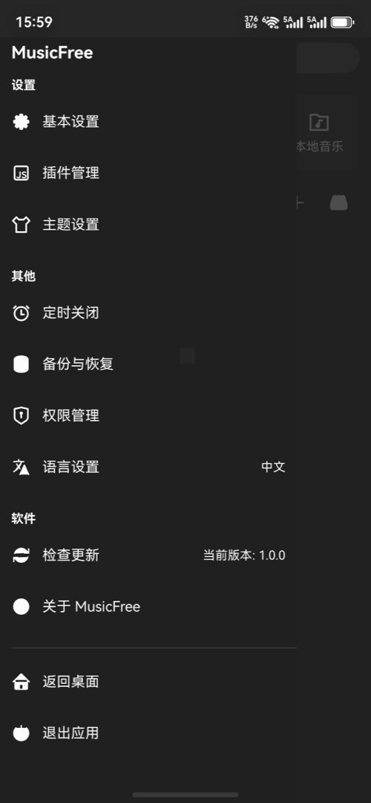
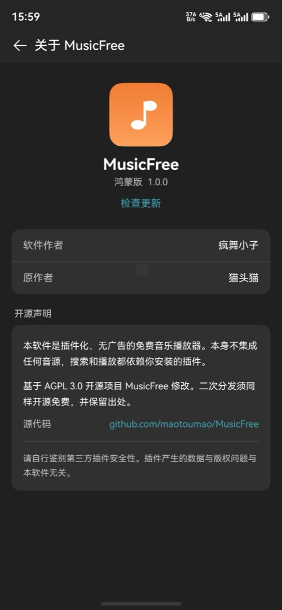
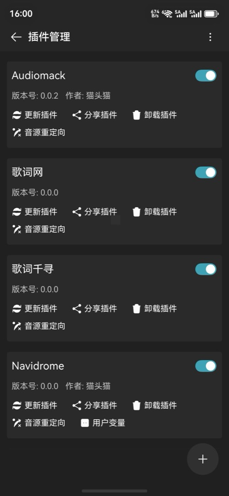

# MusicFree HarmonyOS NEXT

这是 MusicFree 的 **鸿蒙原生版**（ArkTS / ArkUI）。本身不内置音源，装插件后才能搜索和在线播放。

**怎么装：** HarmonyOS NEXT 不能像 Android 那样点一下 HAP 就装上，本仓库也不上华为应用市场（要备案）。请用 [DevEco 自己编译](#如何安装)，或看完整说明 [docs/install.md](docs/install.md)。

## 界面预览

<p>
  
  
  
  
</p>
<p>
  
  
</p>

## 如何安装

需要：一台 HarmonyOS NEXT 真机、一台电脑、[DevEco Studio](https://developer.huawei.com/consumer/cn/deveco-studio/) 5.0 及以上（HarmonyOS SDK API 12 / `5.0.0(12)` 或更高）。

### 1. 打开工程并签名

1. 用 DevEco Studio **打开本仓库根目录**
2. 等待 `ohpm` / `hvigor` 同步完成
3. 手机：设置 → 关于本机 → 连续点击软件版本号，打开开发者模式；再打开 **USB 调试**，用数据线连电脑并允许
4. File → Project Structure → **Signing Configs**，登录华为账号，勾选自动签名（调试包会绑定当前这台手机）
5. 工具栏 Product 选 **`default`**（完整版，带插件）。不要选 `store`，那个没有在线搜索
6. 选中真机，点击 Run

### 2. 命令行安装（可选）

已经能编过包时，可以自己打 HAP 再用 `hdc` 装。`hdc` 在 DevEco 的 `sdk/default/openharmony/toolchains` 目录里。

```bash
hvigorw assembleHap -p product=default -p buildMode=debug --no-daemon

hdc list targets
hdc -t <设备ID> install -r entry/build/default/outputs/default/entry-default-signed.hap
hdc -t <设备ID> shell aa start -a EntryAbility -b fun.upup.musicfree.harmony
```

`hvigorw` 和 `hdc` 都在 DevEco 安装目录里（macOS 一般是 `Contents/tools/hvigor/bin` 和 `Contents/sdk/default/openharmony/toolchains`）。仓库根目录没有这两个命令。

无线调试：手机开发者选项里打开无线调试，执行 `hdc tconn 手机IP:端口`。

**别人打的调试 HAP 你装不上。** 换手机也要重新自动签名。文件管理里直接点 HAP 通常无效。更细的步骤、卸装命令和排错见 [docs/install.md](docs/install.md)。

包名：`fun.upup.musicfree.harmony`

## 和原版的对应关系

- 插件化播放器：本身不内置音源，通过安装 MusicFree 协议的 `.js` 插件完成搜索、播放、歌词、歌单等
- 插件在隐藏 WebView 沙箱中运行（ArkTS 不允许 `eval`），并提供 `axios` / `crypto-js` / `cheerio` / `dayjs` / `qs` 等常用依赖的兼容实现
- 播放使用系统 `AVPlayer` + `AVSession`，支持后台播放和锁屏控制
- 主题：深色 / 浅色 / 自定义背景（模糊与透明度），配色对齐原版（浅色主色 `#F17D34`，深色主色 `#3FA3B5`）
- 下载队列、WebDAV 备份恢复、定时关闭、插件订阅与排序、应用内悬浮歌词条
- 歌词偏移 / 翻译 / 搜索关联、歌单批量编辑与列表内搜索、检查更新、媒体缓存

## 已实现的页面

- 首页：侧边栏、搜索入口、推荐/榜单/历史/本地、我的歌单与收藏歌单、导入歌单、定时关闭、检查更新
- 搜索：单曲 / 专辑 / 作者 / 歌单（点击播放或替换播放列表）
- 播放详情：封面、歌词（字号 / 偏移 / 翻译 / 关联）、进度、循环模式、下载
- 搜索歌词、歌单批量编辑、列表内搜索
- 插件管理：网络/本地安装、订阅、排序、更新全部、启用/卸载
- 正在下载、本地音乐、播放历史、主题/自定义背景、基本设置、关于
- 备份与恢复：本地沙箱 + WebDAV，append / overwrite

## 两个版本（给自己编译用）

同一套代码可以打两种包。对外安装请用 **`default`**。`store` 是以前准备上架用的本地版，**当前不上应用市场**。

| | GitHub 完整版 `default` | 本地版 `store` |
|---|---|---|
| 插件 / 在线搜索 / 榜单 | 有 | 无 |
| 本地音乐、歌单、主题 | 有 | 有 |
| 怎么装 | DevEco / hdc，见上文 | 同样要自己编；不是商店安装包 |

```bash
# 完整版（请用这个）
hvigorw assembleHap -p product=default -p buildMode=debug --no-daemon

# 仅本地音乐的包
hvigorw assembleHap -p product=store -p buildMode=debug --no-daemon
```

证书和密钥不要提交到 Git。示例配置见 `build-profile.example.json5`。若以后要上华为商店（需备案），见 [docs/store-release.md](docs/store-release.md)。

## 使用插件

打开应用 → 侧边栏 → **插件管理**：

- 从网络安装：填入以 `.js` 结尾的插件地址，或以 `.json` 结尾的订阅地址
- 从本地安装：选择 `.js` / `.json` 文件

同一解析地址只会保留一份插件（换个名字再装会覆盖，不会重复）。

插件协议与原版一致，可参考：[插件开发文档](https://musicfree.catcat.work/plugin/introduction.html)

示例插件仓库：https://github.com/maotoumao/MusicFreePlugins

> 请自行鉴别第三方插件安全性。插件产生的数据与版权问题与本软件无关。

## 协议

基于 AGPL 3.0 开源项目 MusicFree 修改。二次分发请保留出处：https://github.com/maotoumao/MusicFree
